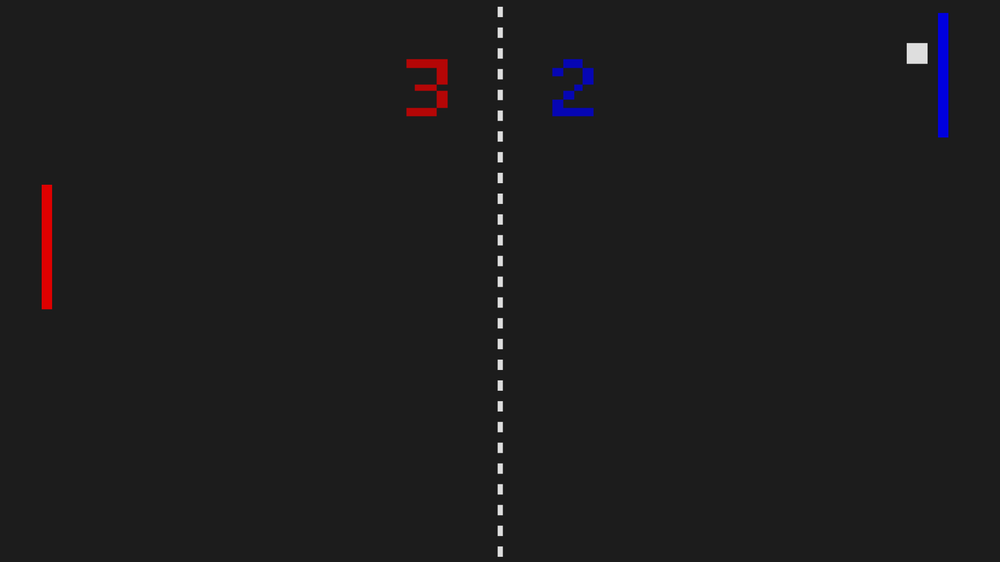

# Pong SDL

This is my implementation of the classic Pong game, made using C++ and the Simple DirectMedia Layer (SDL2).  

<p align="center">

</p>

## Table of Contents

- [Objective](#objective)
- [Features](#features)
- [Controls](#controls)
- [Configurations](#configurations)
- [Building/Running](#building-and-running)
- [Final Notes](#final-notes)

## Objective

The goal of this project was to learn how to work with a Graphical User Interface (GUI) from a lower-level perspective (hence why I chose SDL2) and improve some of my skills in C++ (since I only have a few months of experience with it).  
It's also a good way to get started in game development and create something to play while bored on my computer :)

## Features
The game consists of some simple features such as:  
 
 - **Graphical Window**: the game should (obviously) have a graphical window to render contents, that's why I opted for SDL in the first place.
 - **Keyboard Input**: to control the paddle, the game must read keyboard inputs and act accordingly, again, this was done through SDL.
 - **Object Movement**: the different objects should have different movements (updated at each frame) and should behave differently regarding inputs and positions
 - **Collision Detection**: the ball should know how to react when it encounters screen borders or player paddles. In this, case, the rebound angle depends on the location of contact.
 - **CPU Opponent**: a simple opponent controlled using a simple set of instructions and responses. It is not too advanced but it was very useful to learn a little bit about AI and how it should respond and be updated. Besides, it makes it possible to play alone with a bigger challenge.
 - **Sound Effects**: as a bonus, I also added some sound effects to make the game more responsive and fun. This was also made with SDL.

## Controls

The controls for this game are very straightforward:

- **```W```**: move player paddle up 
- **```S```**: move player paddle down 
- **```ESC```**: exit the game 


## Configurations

All settings/tweaks that are expected should be changed in the [constants file](/src/constants.h). After these changes, recompile everything for them to take effect. These can include:

##### Paddle Colors (RGB values)

```
static SDL_Color RIGHT_PADDLE_COLOR = {0,0,222,200};
static SDL_Color LEFT_PADDLE_COLOR = {222,0,0,200};
```

##### Max Score (goals)

```
static int maxScore = 9;
```

##### Difficulty Multiplier

```
static int maxScore = 9;
```

##### Window Dimensions (pixels)

```
static int WINDOW_WIDTH = 1920;
static int WINDOW_HEIGHT = 1080;
```

##### Frames per Second (FPS)

```
static int FPS = 30;
```

## Building and Running

To run this, the SDL2 libraries (sdl2, sdl2_mixer, sdl2_ttf) are needed. The run configurations are all managed by a Makefile I've put together. The different operations are:

- ```make build```: compile the game from scratch
- ```make run```: run the executable file generated
- ```make clean```: remove the executable files

## Final Notes

As stated in the introduction, this project is not perfect and has some aspects that can be perfected and improved, but, at the time of making it, this was the best I could make with what I knew and I hope it serves as an example for other projects.  

Learning to work with GUIs seems daunting and can be quite challenging as there are a lot of different areas to cover (rendering, inputs, sound, fonts,...) but making projects like this is no doubt a great way to get started.

> Made in: August 2023